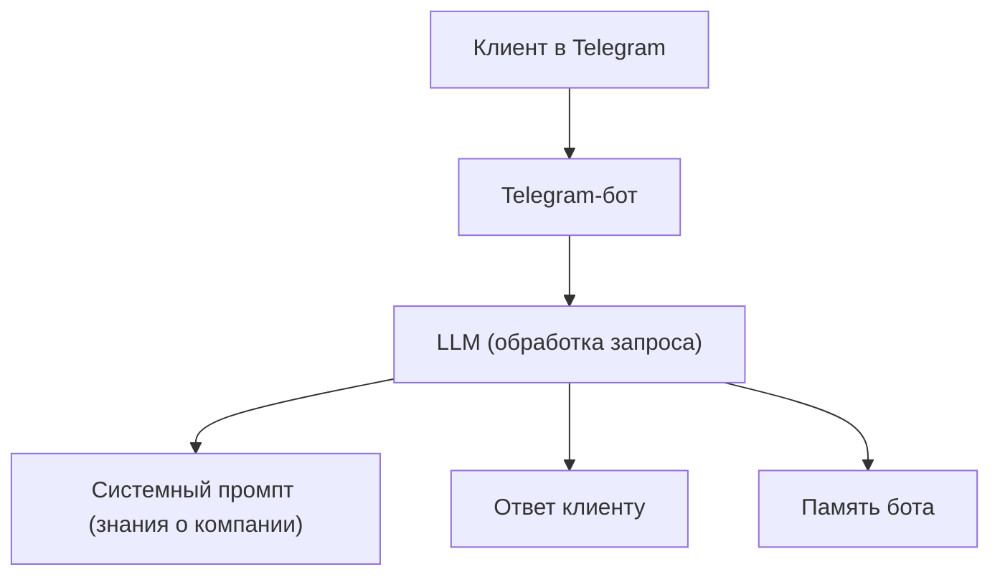

# Идея: LLM-ассистент для консультаций клиентов в Telegram

## Введение

В современном мире автоматизация первичного взаимодействия с клиентами становится всё более востребованной. Моя идея — создать интеллектуального ассистента на базе LLM (Large Language Model), который будет работать в виде Telegram-бота и обеспечивать первичную консультацию клиентов по услугам моей компании.

## Цели проекта

- **Автоматизация первичного общения**: снизить нагрузку на сотрудников, предоставляя клиентам быстрые и точные ответы на типовые вопросы.
- **Повышение качества сервиса**: обеспечить оперативную и корректную обработку запросов клиентов 24/7.
- **Сбор информации о клиентах**: выявлять потребности и проблемы клиентов для дальнейшей персонализации предложений.

## Основные задачи ассистента

- Отвечать на вопросы клиентов о компании и её услугах.
- Уточнять детали запроса, чтобы лучше понять потребности клиента.
- Предлагать релевантные услуги компании для решения выявленных проблем.

## Сценарии использования

### 1. Первичная консультация

Клиент пишет в Telegram-бот, интересуется услугами компании. Бот уточняет детали, рассказывает о подходящих услугах, отвечает на дополнительные вопросы.

### 2. Квалификация лида

Бот задаёт уточняющие вопросы, чтобы понять, насколько клиент заинтересован и какие задачи он хочет решить. На основе ответов бот может предложить персонализированные услуги.

### 3. Запись на консультацию

Если клиент заинтересован, бот может предложить записаться на консультацию с живым специалистом, собрать контактные данные и передать их в CRM.

### 4. Сбор обратной связи

После консультации бот может запросить у клиента оценку качества сервиса и предложения по улучшению.

## Архитектура решения

- **Telegram-бот**: интерфейс для общения с клиентами.
- **LLM (например, GPT-4)**: обработка естественного языка, генерация ответов, анализ запросов.
- **Системный промпт**: содержит актуальную информацию о компании и услугах, подготовленную вручную.
- **Память бота**: все данные о взаимодействии с клиентами и их запросах будут храниться в памяти ассистента (например, в оперативной памяти или временном хранилище), без долговременного сохранения в сторонних сервисах.

